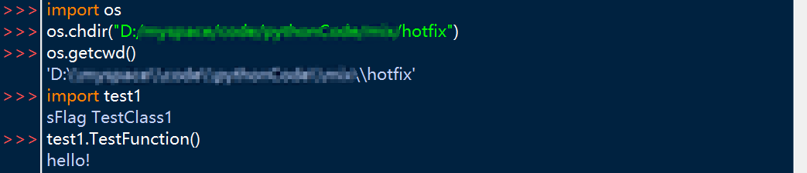
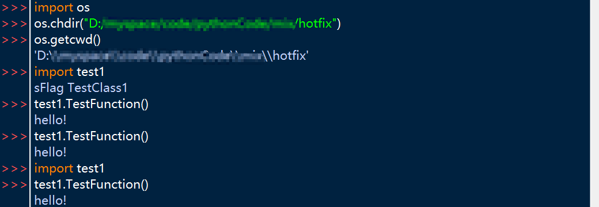
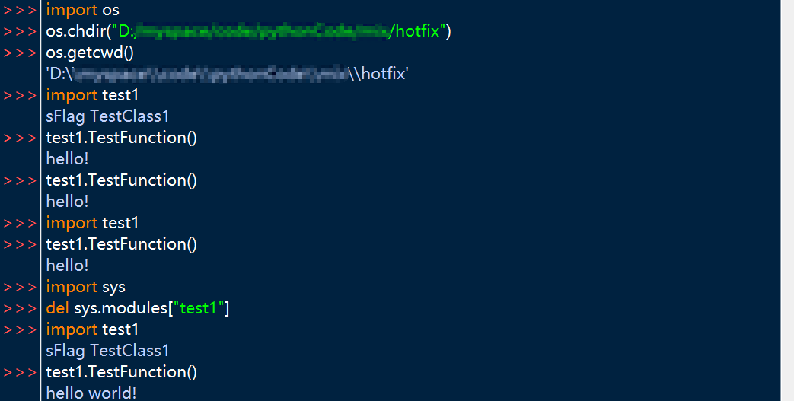
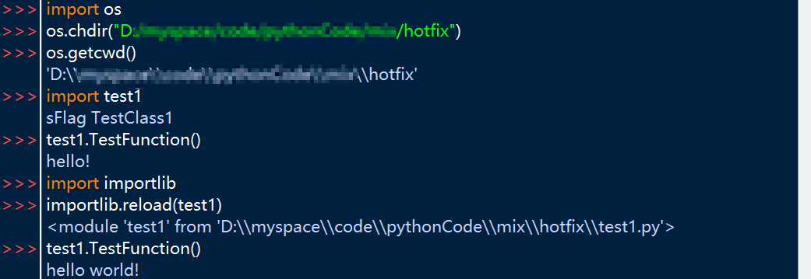

# 服务器热更

- 本篇文章内容主要是以服务器热更为基础的。
- 本篇文章内容主要以python语言的热更为例介绍热更的相关知识。
- 由于笔者的能力和经历有限，文章内容可能会有错误的地方，欢迎指正。

## 1. 什么是服务器热更

- 笼统地说，服务器热更是指在不关服的情况下，将旧代码更新为当前版本代码的操作。在具体业务场景中，我们可以选择更新指定的文件，也可以结合版本控制工具，将代码更新或还原到某个版本，再将旧代码更新到指定的版本。

## 2. 使用场景

- 日常开发。在日常开发的调试过程中，当我们修改完代码后，可以选择重新开关自己的测试服务器（这其中包含了使用最新代码的过程），然后达到更新的目的，但实际上我们仅仅需要的是将部分代码更新，这时热更就能帮助我们完成这个任务。
- 线上修复。对于已经上线的项目，当我们需要修改bug，或者临时添加一些功能时，就要对旧代码进行“更新”，这时一般我们并不会去采用重启服务器的方式，因为这样需要先将所有的用户踢下线，这种情况下热更就能起到作用了。但是如果当前的问题无法通过热更去解决，那就只能冒着降低用户好感度的风险去重启服务器了，所以我们需要尽可能地让热更覆盖到所有的业务代码（个人认为对于基础架构或核心代码，保证其正确是更重要的）。
- 不停机维护。和线上修复类似，这里就不赘述了。

## 3. 分类

这里的分类并不是严格的对热更进行分类，而是对“热更”这种广义的行为进行分类（即不停服的情况下实现更新），可能这里说的比较模糊，大家看下面两个例子就明白了：

`注：对于这两种方式，笔者也不太清楚哪种方式应用更广泛，根据笔者的经历，主要是真热更的方式，因为对于假热更的方式，由于笔者能力和经历有限，不太能分析出其中的优缺点，所以就不妄下判断了，当然文章后续会着重介绍真热更的相关内容。`

- 假热更：常见的操作是，假设我们线上版本是1.1，此时我们需要紧急修复一个bug并发布，此时的新代码版本是1.2，为了保证不停服的情况下让用户使用最新的代码，我们需要在准备一个服，以游戏为例：可以在玩家切换地图时，将玩家从老版本的服转移到新版本的服，这样做可以在玩家感知不到的情况下完成更新。当然对于不同的业务常见可以采用不同的手段。
- 真热更：个人理解是在不需要重启服务器进程的情况下，完成代码的更新。（`在网上查了一些资料，个人觉得不需要纠结所谓的服务器进程是否需要关闭，如果从用户角度来看，如果用户不需要退出当前的应用或者做其他操作，然后达到了新代码被使用的效果，那么就是热更。`）以python为例，它为我们提供了reload()函数，本质上是将某个模块删除然后再重新导入。

## 4. python热更原理

由于笔者能力有限，对于其他语言的热更实现并不了解。

这里以python的`reload()`函数为例，简单介绍下热更原理。

### 4.1 模块导入

讲解热更之前，我们需要先了解一下python是如何导入一个模块的。

#### 4.1.1 模块导入流程

- Python会首先检查`sys.modules`中是否已经存在需要导入的模块对象，如果存在，则直接使用该对象。
- 如果不存在，则搜索当前目录和Python路径中是否存在指定的模块文件。
- 如果找到了指定的模块文件，Python会编译该文件并将其转换为字节码形式。
- 如果在导入过程中发现了其他的导入语句，那么Python会递归地执行这些导入语句，直到所有需要的模块都被加载为止。
- 将模块中定义的所有变量、函数和类加载到内存中，以供后续代码使用。
- 返回一个指向该模块命名空间的引用，使得我们可以通过该引用来访问该模块中定义的所有内容。

需要注意的是，当Python第一次导入一个模块时，它会在内存中缓存该模块的对象。因此，如果同一个模块被多次导入，Python只会加载一次，而后续的导入操作都会返回缓存的模块对象。

#### 4.1.2 几种不同的导入方式

假设当前我们已有一个`test1.py`文件：

```python
# test1.py

class CTestClass:
    def __init__(self, sFlag: str):
        print('sFlag', sFlag)
        self.m_Flag = sFlag


if "g_TestClass1" not in globals():
    g_TestClass1 = CTestClass('TestClass1')


def TestFunction():
    print('hello!')
```

现在我们在`test2.py`模块下，以三种不同的导入方式来导入`test1.py`模块下的内容：

- ```python
  import test1
  ```

  当我们直接导入`test1`模块时，Python会在`sys.modules`中创建一个名为`test1`的模块对象，同时在`test2.py`的全局命名空间中创建一个名为`test1`的引用，指向该模块对象。

- ```python
  from test1 import CTestClass
  ```

  当我导入`test1`模块中的`CTestClass`类时，Python会从`test1`模块中导入`CTestClass`类，并将其放在`test2.py`的全局命名空间中。也就是说，我在`test2.py`中就可以直接使用`CTestClass`类，而无需在调用时使用`test1.CTestClass`这样的限定符。注意此时我们并没有导入`test1`模块，因此没有`test1`的模块对象，使用`test1.CTestClass`这样的操作是非法的。

- ```python
  from test1 import *
  ```

  首先这种import *的方式是不推荐使用的，这里仅用于举例介绍。具体这种方式的缺点这里就不赘述了。

  本质上和第二种情况相同，这里也不赘述了。

### 4.2 热更示例

了解过模块导入过程之后，我会以具体的例子来帮助大家认识热更以及python提供的热更方式：`reload()`。

#### 4.2.1 手动修改 sys.modules

同样地，我们引入`test2.py`文件，对`test1`模块中的内容进行import操作，并且尝试热更`test1`模块。（这里以`import test1`操作为例进行说明，如果大家感兴趣，也可以试一下例如`from test1 import CTestClass`的操作，这样也能加深自己的理解，毕竟talk is cheap，show me the code。）

- 为了方便演示，我们使用IDLE来进行操作。先切换到`test1.py`文件所在的目录，方便我们进行import操作：

  

- 接下来我们直接导入`test1`模块，并且调用`TestFunction()`函数：

  

  可以看到，当我们第一次导入`test1`模块时，它会把该模块下的代码执行一遍，其中包括：`CTestClass`类的声明，`g_TestClass1`全局变量的创建，以及`TestFunction()`函数的声明。并且我们也成功调用了`test1.TestFunction()`。

- 接下来我们修改`test1.py`下的`TestFunction()`函数，将其中的`print('hello!')`语句修改为`print('hello world!')`：

  ```python
  # test1.py
  
  class CTestClass:
      def __init__(self, sFlag: str):
          print('sFlag', sFlag)
          self.m_Flag = sFlag
  
  
  if "g_TestClass1" not in globals():
      g_TestClass1 = CTestClass('TestClass1')
  
  
  def TestFunction():
      print('hello world!')
  ```

- 此时，无论我们是直接调用`test1.TestFunction()`还是先`import test1`再调用`test1.TestFunction()`，输出仍然是`hello!`：

  

  对于直接调用`test1.TestFunction()`，显然我们都没有将修改后的代码进行“导入”操作，输出自然不会变化；而对于先`import test1`再调用`test1.TestFunction()`，同样地，根据`4.1.1 模块导入流程`中的介绍，“如果一个模块被多次导入，Python只会加载一次，而后续的导入操作都会返回缓存的模块对象”，所以输出也没有发生变化。

- 这时如果我们尝试先在`sys.modules`中删除对`test1`模块对象的引用的话，是不是就能再次导入了呢？

  

  可以看到，当我们从`sys.modules`中删除了`test1`模块对象的引用之后，重新执行`import test1`，就可以将`test1`模块重新导入一次了，这也符合前面介绍的模块导入的流程。

- 小结：在这个示例中，我们可以发现几个问题：

  - 手动删除旧模块对象的引用，然后再次`import`，实际上是创建了两个模块对象，新旧两个模块对象的地址也会不同。
  - 当我们重新导入模块时，旧模块中的内容实际上全部被删除了。可以看到，在执行了`del`操作并重新导入`test1`模块后，又创建了一次全局变量`g_TestClass1`。（大家可以尝试使用`id()`直接打印看看相关对象的地址，这里我就不演示了）

#### 4.2.2 reload()

- `importlib`模块是Python标准库中用于动态加载模块和操作模块对象的模块。其中，`reload`函数是该模块中一个常用的函数，它用于重新加载一个已经导入的模块，并更新该模块对象中的代码和数据。

- 当我们调用`importlib.reload(module)`函数时，Python会执行以下步骤：

  - 首先，Python会检查`sys.modules`字典中是否存在指定的模块对象，如果存在，则直接使用该对象；否则，Python会抛出`ModuleNotFoundError`异常。
  - 接着，Python会创建一个新的空的模块对象，并将该对象保存到`sys.modules`字典中，这样做是为了让后续的导入操作使用新的模块对象。
  - 然后，Python会执行指定模块的源代码，并将其中定义的变量、函数和类等信息加载到新的模块对象中。
  - 最后，Python会将新的模块对象赋值给原先的模块变量，以便后续代码可以使用更新后的模块对象。

- 根据`reload()`函数的流程，我们可以总结出以下特点：

  - 原模块对象并不会被删除。
  - 如果改动是删除数据，那么热更之后，我们还是可以访问到旧数据，因为它没有被删除，也不会被覆盖；如果是改动现有的数据或者新增数据，都可以正常访问到最新的值。

- 下面我们还是以刚才的例子来具体操作下：（同样这里还是以`import test1`操作为例进行说明，如果大家感兴趣，也可以试一下例如`from test1 import CTestClass`的操作）

  在执行`reload()`函数之前，将`test1.py`中的`TestFunction()`函数进行修改：

  

  从这个例子中，我们可以看到：

  - `reload()`函数成功将`TestFunction()`函数进行了热更。
  - 在执行`reload()`函数进行模块的重新加载时，`g_TestClass1`全局变量没有重新创建，这是因为，我们判断了`if "g_TestClass1" not in globals()`，而此时`g_TestClass1`是在`test1`这个模块对象的全局名字空间里的，所以不会重复创建。

### 4.3 总结

- `reload()`函数为我们提供了一个基本的热更思路和手段，能够简单实现一个模块的热更，但是它也只能重新加载模块代码并更新模块对象。同时，它也有一些隐患：`reload`函数只会重新加载指定模块的代码和数据，而不会对该模块导入的其他模块进行重新加载。此外，`reload`函数会执行模块中所有的顶层语句，包括`import`语句，因此，如果一个模块中包含了其他模块的导入语句，那么在调用`reload`函数时，这些导入语句也会被重新执行，从而可能会导致某些副作用。
- 在实际业务场景中，进行热更要考虑的问题有很多：代码兼容性，线程安全等等。这里笔者提供一个思路给大家研究：我们以对象类型进行分类，假设我们需要热更这些对象：
  - 类：普通类、枚举类（举一个例子：如果类的\_\_init\_\_()方法新增了一个属性，那么如何让旧的实例化对象也新增这个属性。）
  - 函数：类函数、实例函数、静态函数
- 由于笔者能力和经历有限，还无法为大家提供一个通过的热更框架，后续如果能力达标了，会补充这部分内容。
